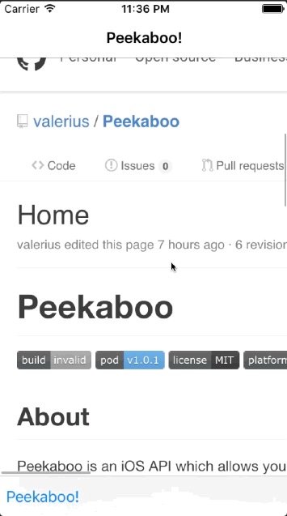

# Peekaboo

[](https://travis-ci.org/James Whitfield/Peekaboo)
[](http://cocoapods.org/pods/Peekaboo)
[](http://cocoapods.org/pods/Peekaboo)
[](http://cocoapods.org/pods/Peekaboo)




## About

Peekaboo is an iOS API which allows you easily use a UIScrollView to automatically hide the navigation and toolbar or
other UIViews you configure using optional delegate methods.

## Usage

To run the example project, clone the repo, and run `pod install` from the Example directory first.

## Installation

Peekaboo is available through [CocoaPods](http://cocoapods.org). To install
it, simply add the following line to your Podfile:

```ruby
pod "Peekaboo"
```

## Integration
Peekaboo was intended to be simple and can be configured with one line of code for most usages, but also provides 
additional flexiablity using delegation. What makes its implementation different from other worthy mentions its that it 
assumes little, and can hide navigation & toolbars in a standard way if you prefer, or allow you to perform the necessary 
transitions in delegate methods in your own customized fashion without the need for subclasses. Its need arose as a result 
of other API's doing 90% of what I needed, but because it was so custom required hacking the code to suite my usecase. 
Thus, this API is designed abstractly to allow detection/configuration of the event triggered via UIScrollView to notify you that the
"viewport" should expand or contract, and nothing more. You do the rest as follows:

```objective-c
    #import <Peekaboo/Peekaboo.h>

    @interface YourViewController : UIViewController <NEIPeekabooDelegate>
    @end

    @implementation YourViewController
    - (void) viewDidLoad {
        [super viewDidLoad];
        [self enablePeekabooUsingScrollView:scrollView
                                       mask:NEIPeekabooAutomaximizeNavigatorBar | NEIPeekabooAutomaximizeToolbar
                                   delegate:self];

    }

    /******************************************************************************************************************
        Following methods have no relation with optional mask NEIPeekabooAutomaximizeNavigatorBar and NEIPeekabooAutomaximizeToolbar,
        but can used to instead of or in conjuction with mask to expand or contract views to maximize space. Mask if provided,
        allow you to not have to hide or show respective controllers manually, but if provided, are maniuplated using standard
        show/hide navigation and toolbar methods. If used, you must conform to NEIPeekabooDelegate protocol.
     ******************************************************************************************************************/
    #pragma mark - NEIPeekabooDelegate

    - (BOOL)peekabooViewportIsMaximized {
        // optional: you can use any logic to determine if its maximized, otherwise internal logic is used of not implemented
        return self.navigationController.navigationBarHidden;
    }

    - (BOOL)peekabooShouldAlterViewport:(id)scrollView maximized:(BOOL)maximized {
        return YES; //optional: always defaults to YES
    }
    - (void)peekabooWillAlterViewport:(id)scrollView maximized:(BOOL)maximized {
        //optional: You can add your own code that will add/reduce available space.
    }

    - (void)peekabooDidAlterViewport:(id)scrollView maximized:(BOOL)maximized {
        //optional: You can add your own code that will add/reduce available space.
    }
    @end
```

## Author

GHOST, ghost (at) neilab.com

## License

Peekaboo is available under the MIT license. See the LICENSE file for more info.
